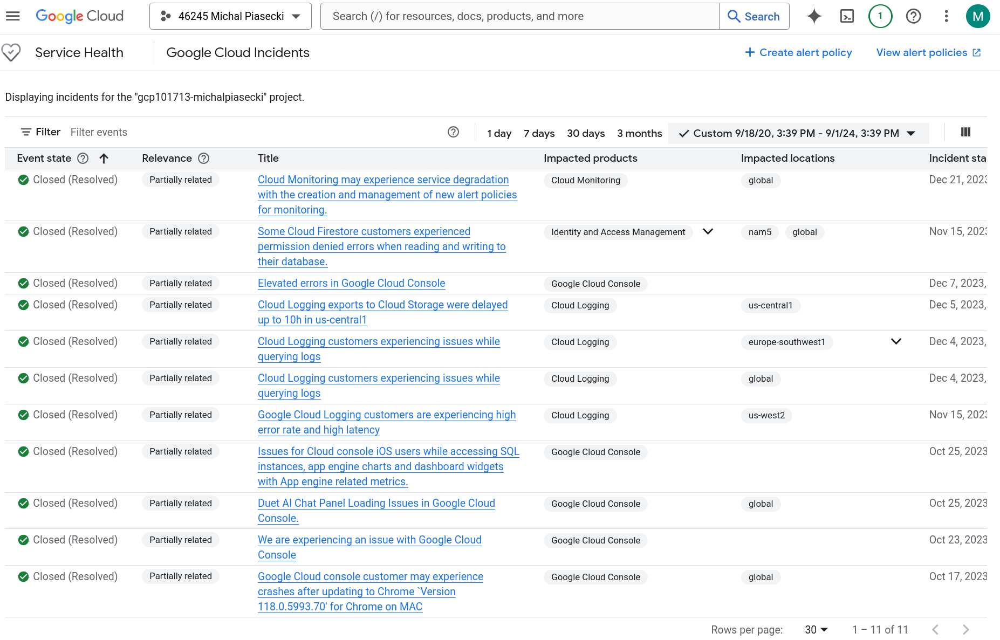

## Alerts for LZ  
Try to find as native solution as possible. Look into Operations Suite, and things.

### Service health monitoring. To watch GCP services health, and send alerts during service outages.  
- Solution for that would be [Personalized Service Health dashboard](https://console.cloud.google.com/servicehealth). It helps accessing more detailed overview of incidents affecting yout GCP projects. It can contain custom alerts and logs.
- It needs enabing Service Health API
- Service Health dashboard displays list of incidents for given period of time.

- It is possible to create alert policy. Possible options are:
  - All incidents and all alerts. 
    - Receive ongoing status updates for any incident until the incident is resolved.
  - Confirmed relevant incidents. 
    - Receive an alert if there is any potential impact for services or locations relevant to this project
  - Emerging incidents. 
    - Receive an alert when new issue is detected, but not yet confirmed as an incident.
  - Location alerts. 
    - Receive alerts about any incidents that impacts a location specified in the policy.
  - Product alerts
    - Receive alerts about any incidents that impacts a service specified in the policy.
  - New incident
    - shorter format, suitable for SMS
- It is required to use [notification channel](https://cloud.google.com/monitoring/support/notification-options)
  - Among other options, notification channel can be configured as:
    - Slack connection
    - Webhook
    - email
    - SMS
    - Pub/Sub
---------------------
### Resource-level health feed. To watch health of resources in GCP project and send alerts during service outage.

#### Cloud Monitoring
Primary tool for monitoring resources in GCP. It provides metrics, dashboards, alerts, and logs for GCP resources. Allows to create alert policies. Whenever resource metrics breach certain treshold, alert will be fired. Alerts can be based on:
- cpu
- memory
- i/o
- uptime checks
- or many more 

##### Metrics
- Cloud Monitoring automatically gathers metrics from GCP resources like Compute Engine, Cloud SQL, Kubernetes Engine, and more.
- You can view real-time metrics such as CPU utilization, memory usage, disk I/O, network traffic, etc.

##### Dashboards:
- GCP provides predefined dashboards for common services.
- You can create custom dashboards to visualize the health of specific resources or applications.

##### Uptime Checks:
- Uptime checks help monitor the availability of services and endpoints. You can create an uptime check to ping or query services from multiple geographic locations.
- You can receive alerts when an uptime check fails.

##### Custom Metrics:
- You can sent custom metrics from your application to Cloud Monitoring for more information.
- Logs from Cloud Logging can be used to create custom metrics.

##### Cloud Trace
Cloud Trace helps analyze latency and performance issues in applications. It traces the requests, as they pass through various services.

##### GKE Monitoring
Google Kubernetes Engine provides specific features for k8s monitoring, like:
- k8s native metris - node health, pod cpu/memory usage
- integration with Prometheus, for additional options of monitoring and alerting
- dashboards for GKE

##### Cloud SQL
GCP provides additional metrics for databases such as:
- query performance and latency
- connection limits and errors

#### Set up the monitoring
- enable Cloud Monitoring and Cloud logging API
- create dashboards and uptime checks
- create alerts based on resource metrics
- create notification channel
- use Cloud Trace to trace issues in distributed systems